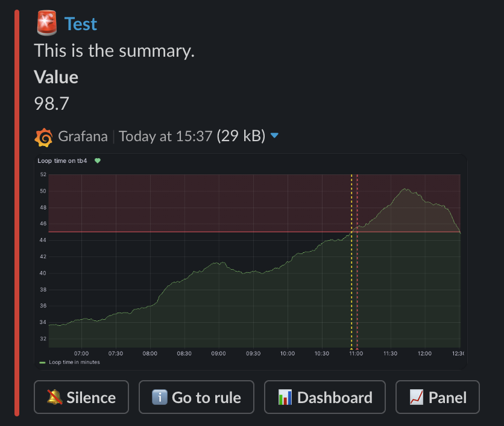
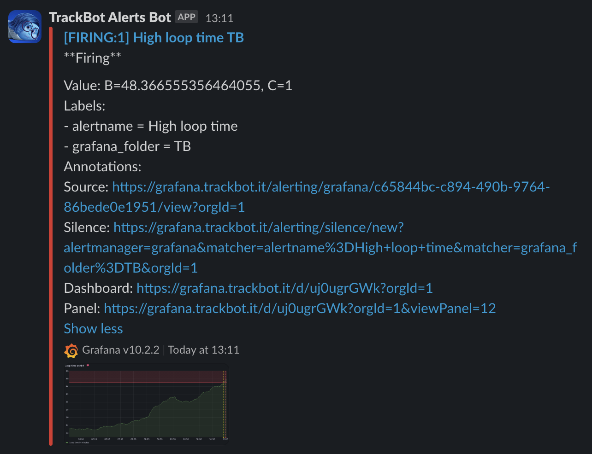
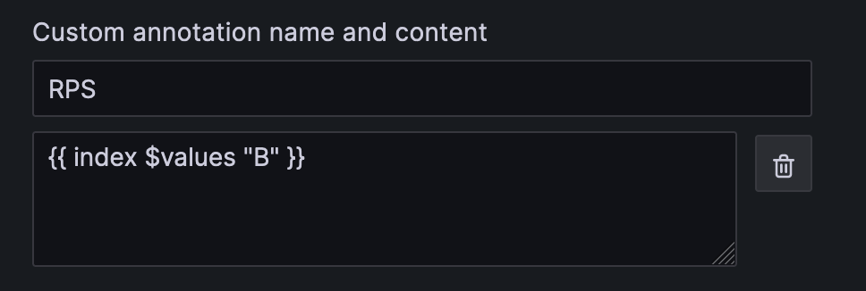

# grafana-slack-alerts

This small project takes Grafana alert webhook requests and sends them to Slack.

This project exists because since unified alerting was introduced in Grafana, the Slack integration produces messages that are hard to read and with limited customization.

This is how messages generated by this project look like:



While this is how messages generated by the Grafana Slack integration look like:



## Deployment

Deploy as a Docker container. See available tags [here on Docker Hub](https://hub.docker.com/repository/docker/matteocontrini/grafana-slack-relay/tags?page=1&ordering=last_updated).

Provide the following mandatory environment variables:

- `SLACK_WEBHOOK_URL`: The URL of the Slack webhook to send messages to

Optionally, you can also provide the following environment variables:

- `PORT`: The port to listen on (default: `5000`)

Here's an example of a Docker Compose file:

```yaml
services:
    grafana-slack-relay:
      image: matteocontrini/grafana-slack-relay:0.1.1
      stop_signal: SIGINT
      environment:
        - SLACK_WEBHOOK_URL=${SLACK_WEBHOOK_URL}
      ports:
        - 5000:5000
```

In which case you should provide environment variables in a `.env` file:

```shell
SLACK_WEBHOOK_URL=https://hooks.slack.com/services/...
```

## Usage

Configure a webhook notification channel in Grafana and set the URL to the URL of this service.

In the alert configurations, use annotations to specify fields that should be shown in the alert message. For example, the following annotation takes the value of `B` and presents it with the name `RPS`:



```
{{ index $values "B" }}
```

You can also use the alert name, summary and description configuration fields, as they are all included in the alert message.
